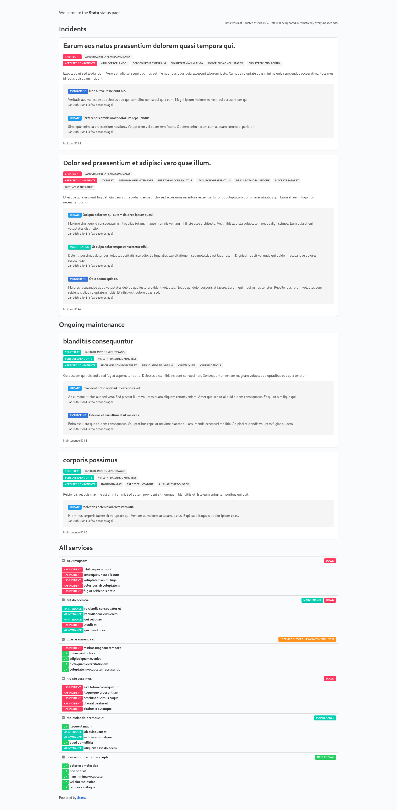

# Statu

> A self-hosted status page based on Laravel.



## Installing

```bash
git clone git@github.com:supertassu/statu.git
cd statu
cp .env.example .env
composer install
php artisan key:generate
php artisan migrate
```

The configuration of Statu is mainly located in `.env` and `config/statu.php`.
**Remember to change the API keys in `config/statu.php`.**

Point your web root directory to `public/`.

## Usage

The main admin interface uses the `artisan` CLI tool.

To view the help menu, use

```bash
php artisan list statu
```

### HTTP API

Statu has an HTTP API. Due to the internal project statu was created on, it sadly uses `GET` for everything :/ (sorry!).
The API keys can be set on the config file.

#### `/api/overview`
The all-on data retrieving endpoint. This gives basically everything that the user is allowed to know.

#### `/api/monitors/{ID}/set?state={BOOLEAN}&api-key={KEY}`
Should be pretty self-explaining. It sets the status for a specified monitor to the specified value.

## Planned features

- Incident history
- Admin UI on web
- some form of upcoming maintenances
- more stuff
